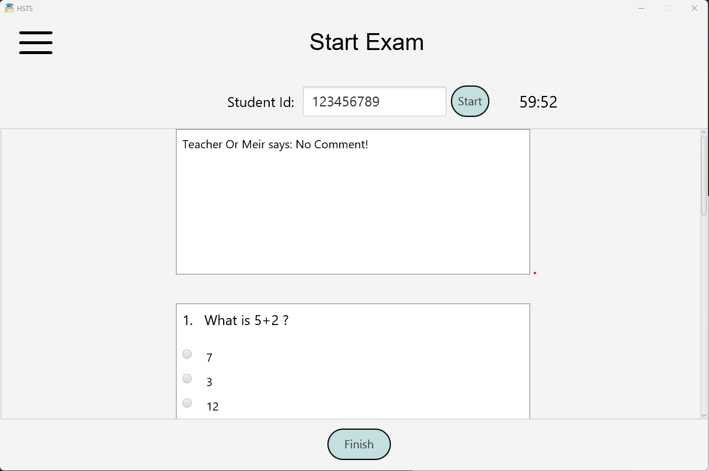

# HSTS – High School Test System

HSTS (High School Test System) is a comprehensive Java application developed to manage and automate the examination process in high schools. It's a full-stack solution leveraging JavaFX for a dynamic user interface, CSS for aesthetics, and MySQL as the underlying database. It offers differnt dynamic usages for students, teachers and principals.

## Features

- **Full-stack Java Application**: The system is built using Java, ensuring efficient and robust solutions, capable of catering to a high school's testing requirements.

- **Dynamic User Interface**: The application's front-end is designed with JavaFX, providing a dynamic and user-friendly interface that allows for ease of interaction for all users.

- **Stylish and Intuitive Design**: Coupled with JavaFX, CSS is utilized to create an aesthetically pleasing and intuitive design, improving the overall user experience.

- **Efficient Server Connection Management**: We've incorporated EventBus for seamless communication between server and client components, ensuring a smooth and uninterrupted service.

- **Robust MySQL Database**: A strong MySQL database is in place to handle data storage and management, promoting efficient and reliable operation.

## Development Cycle

This application was developed as part of the Software Engineer course at University of Haifa. The team covered the entire product lifecycle, starting from drafting the initial user cases, creating class and sequence diagrams, to final implementation. This project showcases effective leadership and project management skills.

## The Team:
1. [Alaa Khamis](https://github.com/alaa-khamis/)
2. [Ahed Khatib](https://github.com/ahedkhatib)
3. [Lana Asadi](https://github.com/LanaAsadi)
4. [Zinab Dahle](https://gith#ub.com/Zinab20)
5. [Ebraheem Ebraheem](https://github.com/ebraheemeb)
6. [Adan Hammoud](https://github.com/adan2501)

## Installation

- Clone the repostory on your local machine.
- Run Maven clean install in the parent project.
- Run the server using the exec:java goal in the server module.
- Run the client using the javafx:run goal in the client module.

## Screenshots

